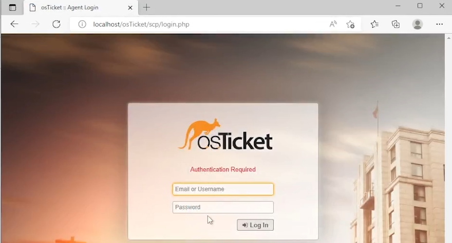

    

# osTicket Post Install Configuration

This tutorial outlines the post install configuration of the open-source help desk ticketing system osTicket.

## Environments and Technologies Used

- Microsoft Azure (Virtual Machines/Compute)
- Remote Desktop
- Internet Information Services (IIS)

## Operating Systems Used

- Windows 10 (21H2)

## List of Prerequisites

- Azure Virtual Machine

## Installation Steps
(image.png)

- Go to "https:www.portal.azure.com"
- click on VM
- click on osTicket VM
- get ip address
- open remote desk top on your computer
- use the IP address to log in

--- 

- In the VM log into osTicket int he web browser:  localhost/osTicket/scp/login

