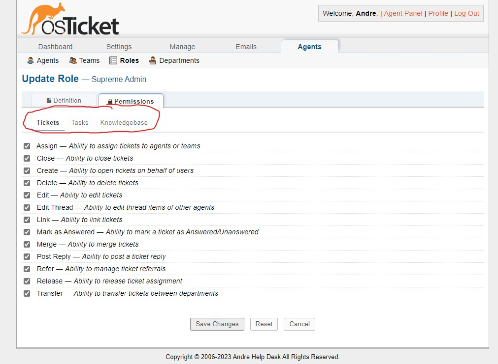

    

# osTicket Post Install Configuration

This tutorial outlines the post install configuration of the open-source help desk ticketing system osTicket.

## Environments and Technologies Used

- Microsoft Azure (Virtual Machines/Compute)
- Remote Desktop
- Internet Information Services (IIS)

## Operating Systems Used

- Windows 10 (21H2)

## List of Prerequisites

- Azure Virtual Machine

## Installation Steps

- Go to "https:www.portal.azure.com"
- click on VM
- click on osTicket VM
- get ip address
- open remote desk top on your computer
- use the IP address to log in

--- 

- In the VM log into osTicket int he web browser:
    localhost/osTicket/scp/login

---

- Go to Admin panel-> Agents-> Roles
- Click add new role
- Name Supreme Admin
- Click Permissions
- Check all boxes under Tickets, Task, and Knowledgebase
- save changes
- now we have role that can do everything

--- 

- Now lets make a new department
- Go to Admin panel-> Agents-> Departments
- click add new department:
    - Name: System Administrators
    - click Create Dept

--- 

- Now we need to make a team
- go to Admin panel-> Agents-> Teams -> add new team
- Name: Level II Support
- click members
- add yourself
- click create team

---

- now we need to allow anyone to create tickets
- go to Admin Panel -> Settings -> Users ->Settings
- uncheck Registration Required: Require registration and login to create tickets 

--- 

